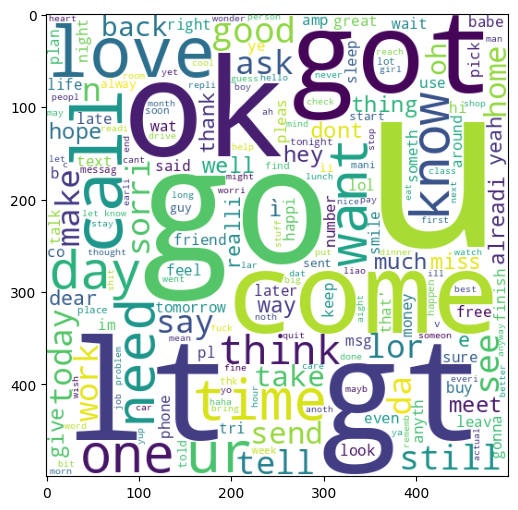

# sms-spam-classifier
Implementing a ML model to detect SMS spam messages using NLP

## Project Structure
sms-spam-detection/
|

├── sms-spam-detection.ipynb

├── app.py

├── model.pkl

├── vectorizer.pkl

└── README.md

---

## Dataset
The dataset used consists of SMS messages labled as **spam** or **ham** (not spam). It goes through preprocessing steps such as:
- Lowercasing
- Stop word removal
- Punctuation removal
- Stemming
- Tokenization

Dataset Link: https://www.kaggle.com/datasets/uciml/sms-spam-collection-dataset

### Feature Pairplot

### Spam Word Cloud

### Ham Word Cloud

### Spam Histogram

### Ham Histogram

## Model Training
A set of classifiersd are trained using Scikit-learn. Each model is evaluated based on accuracy, precision and recall.

## Deployment + Final Result

## Credit
Youtube Tutorial: https://www.youtube.com/watch?v=YncZ0WwxyzU&t=4248s
